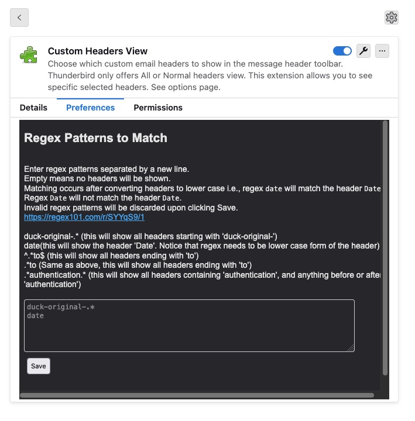

Choose which custom email headers to show in the message header toolbar.

Thunderbird only offers All or Normal headers view. This extension allows you to see certain selected headers like received, sender, x-header, x-google, x-ms-exchange, any PGP headers, list-unsubscribe etc.

Also useful for DuckDuckGo's email protection duck-original- headers to find the original sender email in the original format.

<https://addons.thunderbird.net/En-US/thunderbird/addon/custom-headers-view/>

## USAGE

- After installation, a new button "Headers" will show up in all mail toolbars.

  > 
- Right click > Preferences to go to extension Preferences.

  > 
- Enter regex patterns separated by a new line to choose the desired headers.
- - Empty means no headers will be shown.
- - Matching occurs after converting headers to lower case i.e., regex `date` will match the header `Date`. Regex `Date` will not match the header `Date`.
- - Invalid regexes will be removed upon saving.
- - <https://regex101.com/r/SYYqS9/1>

~~Would be nice if somebody fixed the CSS of the popup table. (:~~

<https://github.com/z-aki/thunderbird_custom_headers_view/pull/7> @s-light has fixed it!
